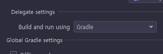
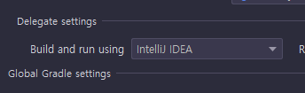
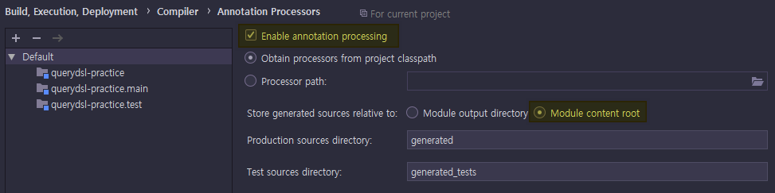

# QueryDSL with Gradle without Spring Framework

*이틀 전에 작성했던 문서대로 다시 해보니까 안되서😒 새로 작성한다. ~~아오빡쳐~~*

일단 QueryDSL을 사용하기 위한 의존성을 추가한다.

	dependencies {
		// ...blahblah...
		compile("com.querydsl:querydsl-jpa:4.2.1")
		compileOnly("com.querydsl:querydsl-apt:4.2.1:jpa")
	}

위앳것은 JPA 환경에서 QueryDSL을 사용하기 위한 API이다.

아랫것은 ```@Entity``` 어노테이션이 붙은 클래스를 스캔해서, 해당 클래스 이름 앞에 ```Q```가 붙은
QueryDSL쿼리 타입 클래스를 자동으로 생성해주는 APT이다.

의존성을 추가했다면 어노테이션 프로세서를 실행하도록 설정해야 하는데, 이건 두가지 케이스가 있다.

## Gradle을 빌드툴로 사용하고, 빌드 과정을 전부 Gradle에 위임하는 경우



인텔리제이를 기준으로, 환경설정(맥OS 기준으로 Cmd + ,)의
```Settings``` > ```Build, Execution, Deployment``` > ```Build Tools``` > ```Gradle``` 페이지의
```Delegate settings``` > ```Build and run using``` 설정이 ```Gradle```로 되어있는 경우, 인텔리제이는 빌드 과정을 모두
Gradle에게 위임한다.

이 경우에는 Gradle의 빌드 스크립트에 어노테이션 프로세서 설정을 직접 해 줘야 한다.

일단 build.gradle 파일의 ```dependencies``` 항목에 어노테이션 프로세서 설정을 한다.

	dependencies {
		// ...blahblah...
		compile("com.querydsl:querydsl-jpa:4.2.1")
		compileOnly("com.querydsl:querydsl-apt:4.2.1:jpa")
		// 어노테이션 프로세서 등록
		annotationProcessor(
			"javax.persistence:javax.persistence-api:2.2",
			"com.querydsl:querydsl-apt:4.2.1:jpa"
		)
	}

```dependencies.annotationProcessor```는 이름 그대로, 추가된 라이브러리들 중 APT인 것을 등록한다.
여기서 주의할 것이, 어노테이션 프로세싱이 진행될 때의 의존성 스코프는 컴파일 때와는 스코프가 다르기 때문에,
APT에 어노테이션 라이브러리가 포함되지 않았다면, 해당하는 어노테이션 라이브러리도 추가해야 한다.

위 설정에서는 QueryDSL-APT 내부에 JPA 어노테이션이 포함되지 않았으므로, JPA-API 라이브러리도 별도로 등록하는 것을
볼 수 있다.
JPA-API 라이브러리는 취향에 따라 하이버네이트 구현체(```org.hibernate.javax.persistence:hibernate-jpa-2.1-api```) 등을
등록해도 관계 없다.

어노테이션 프로세서를 등록했다면, 어노테이션 프로세서 관련 설정을 해야 한다.

아래 스크립트를 ```build.gradle``` 파일에 추가한다.

	def generationPath = file("generated/")
	
	// 어노테이션 프로세서에 의해 자동 생성된 소스코드가 저장될 경로 지정
	compileJava {
		options.annotationProcessorGeneratedSourcesDirectory = generationPath
	}
	
	// clean Task 실행시에 자동 생성된 소스코드를 모두 삭제한다
	clean.doLast {
		generationPath.deleteDir()
	}
	
	// 자동 생성된 소스코드의 경로도 소스셋에 포함한다
	sourceSets {
		main {
			java {
				srcDirs += generationPath
			}
		}
	}

위와 같이 설정한 후, ```build``` 태스크를 실행하면 프로젝트 폴더 하위에 ```generated```라는 폴더가 생성되고,
```@Entity``` 클래스들과 동일한 패키지 경로에 QueryDSL 쿼리 타입 클래스의 소스 코드가 생성된다.

이후부터는 코딩중에 자동 생성된 QueryDSL 쿼리 클래스를 사용할 수 있다. 만약 ```@Entity```가 붙은 클래스가 변경되었다면
```build``` 태스크를 다시 실행해서 자동 생성 클래스를 다시 생성해준다.

```generated``` 폴더는 자동 생성되는 경로이고, 이 폴더 안의 소스 코드도 자동 생성되는 코드이므로 이 경로는 따로
버전관리를 할 필요가 없다. 사용하는 버전관리 시스템에 맞춰서 자동 생성 소스코드 경로를 버전관리 제외한다.

## Gradle은 사용하지만, 빌드 과정을 인텔리제이에 위임하는 경우



인텔리제이를 기준으로, 환경설정(맥OS 기준으로 Cmd + ,)의
```Settings``` > ```Build``` > ```Build Tools``` > ```Gradle``` 페이지의
```Delegate settings``` > ```Build and run using``` 설정이 ```IntelliJ IDEA```로 되어있는 경우,
의존성 관리 등은 Gradle을 사용하지만, 컴파일 등 빌드 과정은 인텔리제이가 수행한다.

이 경우에는 인텔리제이가 직접 어노테이션 프로세서를 실행하도록 설정해줘야 한다.



```Settings``` > ```Build, Execution, Deployment``` > ```Compiler``` > ```Annotation Processors``` 페이지에서
```Enable annotation processing``` 항목을 활성화해주고,
```Store generated sources relative to:``` 항목의 값을 ```Module content root```로 변경한다.

(설정을 변경해야 할 부분에 음영 처리를 해 두었다)

이 상태로 메뉴의 ```Build``` > ```Rebuild Project``` 를 선택해서 새로 빌드하면 QueryDSL 타입의 클래스의 소스 코드가
생성된다.

그런데 이렇게 이렇게 생성된 QueryDSL 타입의 클래스를 소스 코드에서 사용할 수가 없는데, 자동 생성된 소스 코드들을
소스셋에 포함시켜줘야 하기 때문이다.

Project Structure > Modules 설정에서 ```generated``` 경로를 소스셋에 포함시켜 주거나, 빌드 과정을 Gradle에게 위임하는
경우 항목에서 설졍한 SourceSets 항목을 build.gradle 파일에 추가해주고 Gradle 설정을 새로 적용해주면 해결된다.

	sourceSets {
		main {
			java {
				srcDirs += file("generated/")
			}
		}
	}

자동 생성된 소스 코드의 경로를 포함하는 인텔리제이 상에서의 설정 방법은 생략한다.

이후부터는 코딩중에 자동 생성된 QueryDSL 쿼리 클래스를 사용할 수 있다. 만약 ```@Entity```가 붙은 클래스가 변경되었다면
```Build``` > ```Rebuild Project``` 메뉴를 다시 실행해서 자동 생성 클래스를 다시 생성해준다.

```generated``` 폴더는 자동 생성되는 경로이고, 이 폴더 안의 소스 코드도 자동 생성되는 코드이므로 이 경로는 따로
버전관리를 할 필요가 없다. 사용하는 버전관리 시스템에 맞춰서, 자동 생성 소스코드 경로를 버전관리 제외한다.

개인적으로는 build.gradle 파일에 어노테이션 프로세서 설정을 하는 것이, 설정 파일 한번 변경으로 간단하게 해결이 되므로,
그쪽 방법이 더 편리하다고 생각된다.

## Java9 이상을 이용하는 경우

자바 9 이상을 이용하는 경우, ```java.lang.NoClassDefFoundError: javax/annotation/Generated``` 오류가 발생한다.

이때는 ```javax.annotation:javax.annotation-api``` 의존성을 추가하고, 이 의존성을 APT에 등록한 뒤 빌드 과정을
진행하면 문제없이 빌드가 진행된다.

	dependencies {
		// ...blahblah...
		compile("javax.annotation:javax.annotation-api:1.3.2")
		compile("com.querydsl:querydsl-jpa:4.2.1")
		compileOnly("com.querydsl:querydsl-apt:4.2.1:jpa")
		annotationProcessor(
			"javax.annotation:javax.annotation-api:1.3.2",
			"javax.persistence:javax.persistence-api:2.2",
			"com.querydsl:querydsl-apt:4.2.1:jpa"
		)
	}

## References

* [How to use QueryDSL with JPA, Gradle and IDEA](http://bsideup.blogspot.com/2015/04/querydsl-with-gradle-and-idea.html)
* [QueryDSL + JPA + Gradle in IntelliJ](http://izeye.blogspot.com/2015/09/querydsl-jpa-gradle-in-intellij.html)
* [Gradle 5.0에서의 querydsl Q-class 생성](https://netframework.tistory.com/entry/Gradle-50%EC%97%90%EC%84%9C%EC%9D%98-querydsl-Qclass-%EC%83%9D%EC%84%B1)
* [Using QueryDSL annotation processor with Gradle and IntelliJ IDEA](https://blog.jdriven.com/2018/10/using-querydsl-annotation-processor-with-gradle-and-intellij-idea/)
* [Annotation processing breaks with Java 9](https://github.com/querydsl/querydsl/issues/2242#issuecomment-403207700)
* [2019031801-Spring boot에서 Gradle 5.x 빌드 시 Lombok 관련 컴파일 오류 처리](https://eblo.tistory.com/70)